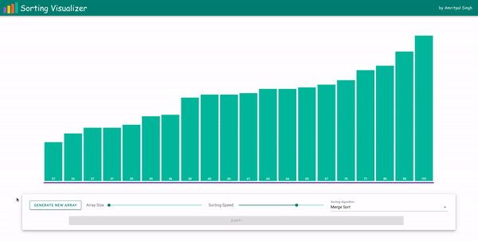

# Sorting Visualizer

## Introduction

* Visualizes various sorting algorithms. 
* Allows changing speed of the animation to better understand the algorithms.
* Allows changing the size of array from 20-200.
* Sorting Algorithms visualized:
    - Merge Sort
    - Bubble Sort
    - Selection Sort
    - Insertion Sort
    - Heap Sort
    - Quick Sort

You can access it here: https://amritpal26.github.io/sorting_visualizer/ 




## Project setup

###
```
npm install
```

#### Compiles and hot-reloads for development
```
npm run serve
```

#### Compiles and minifies for production
```
npm run build
```

#### Lints and fixes files
```
npm run lint
```